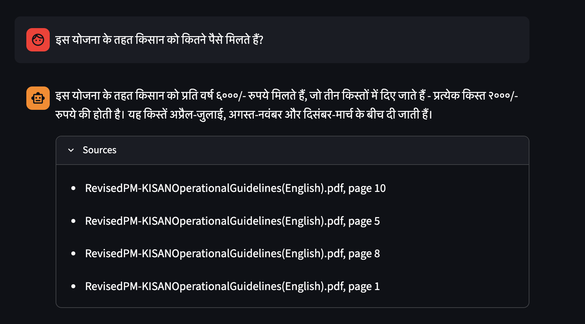
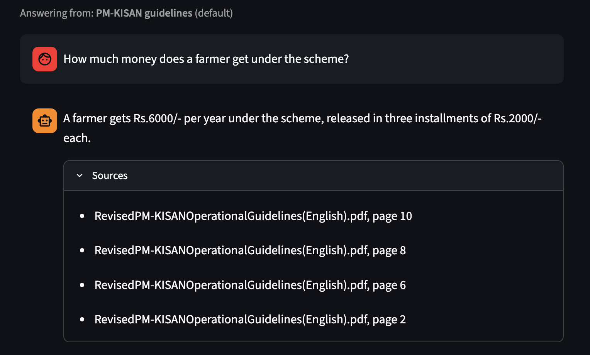
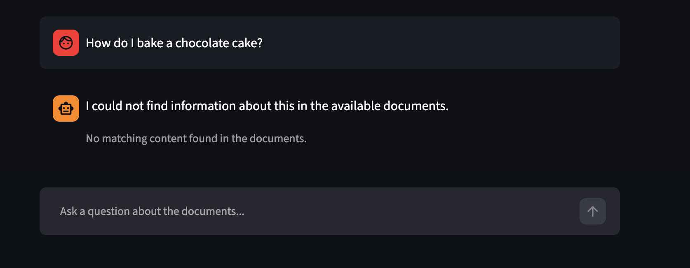

##  Live Demo

**[Try it live → multilingual-rag.streamlit.app](https://multilingual-rag-jbqopnmv6vvnsbfs4czyyc.streamlit.app/)**

Ask questions in Hindi, English, Bengali, or Tamil about the indexed documents — answers are grounded in the source text with citations.


## Screenshots

**Cross-lingual: Hindi question answered from an English document**



**English question with source citations**



**Honest behavior — refuses when no relevant content exists**




# Multilingual Document Assistant (RAG)

A Retrieval-Augmented Generation system that answers questions about documents in **Hindi, English, and other Indian languages** — retrieving from a knowledge base that may be in a *different* language than the question.

Ask *"इस योजना के तहत कितने पैसे मिलते हैं?"* against an English policy document, and get a grounded Hindi answer with cited sources. No translation layer involved.

---

## The core idea: cross-lingual retrieval without translation

The naive way to build a multilingual RAG system is a translation pipeline: detect the language, translate the query to English, retrieve, translate the answer back. Four steps, four points of failure, and compounding translation error.

This project avoids that entirely. It uses a **multilingual embedding model** (`paraphrase-multilingual-MiniLM-L12-v2`) trained with a contrastive objective on parallel sentence pairs — so semantically equivalent sentences in different languages land at nearly the same point in vector space.

Measured on this project:

```
"Which farmers can receive money?"        (English)
"इस योजना के तहत किन किसानों को पैसा मिल सकता है?"  (Hindi, same meaning)
→ cosine similarity: 0.90

"How do I bake a chocolate cake?"          (unrelated English)
→ cosine similarity: -0.04
```

Because meaning determines position and language does not, a Hindi query retrieves the correct English passage directly. The LLM then reads that passage and answers in the query's language.

---

## Architecture

```
INGESTION (offline, once)
  PDF / DOCX / TXT / MD
        │  loaders.py        →  LangChain Documents (one per page, with metadata)
        │  chunking.py       →  recursive split, 800 chars / 150 overlap
        │  embeddings.py     →  384-dim vectors (MiniLM, normalized)
        │  vector_store.py   →  FAISS index written to disk
        ▼
  vectordb/faiss_index.{faiss,pkl}

QUERY (per question)
  user question
        │  language.py       →  detect language (Hindi / English / ...)
        │  retriever.py      →  embed query, FAISS L2 search, drop weak matches
        │  prompts.py        →  grounded prompt: context + rules + target language
        │  llm.py            →  Llama 3.3 70B via Groq, temperature 0
        ▼
  grounded answer + source citations
```

The orchestration lives in `rag.py`, which ties detection, retrieval, prompting, and generation into one call.

---

## Features

- **Cross-lingual retrieval** — Hindi/English/Indic queries against a corpus in any supported language, no translation.
- **Grounded answers only** — the model answers strictly from retrieved text. When nothing relevant is found (distance threshold), it says so instead of hallucinating.
- **Source citations** — every answer shows which document and page it came from.
- **Live document upload** — drop a PDF/DOCX/TXT in the UI and query it immediately; the full ingestion pipeline runs in-browser.
- **Language detection** — answers are returned in the language the question was asked in.
- **Multi-format loaders** — PDF, DOCX, TXT, Markdown.

---

## Tech stack

| Layer | Choice | Why |
|---|---|---|
| Embeddings | `paraphrase-multilingual-MiniLM-L12-v2` | 50+ languages, small enough to deploy on free tiers |
| Vector store | FAISS (`IndexFlatL2`) | Exact search, in-process, no server |
| LLM | Llama 3.3 70B via Groq | Free API, strong multilingual instruction-following |
| Framework | LangChain | Swappable loaders, vector stores, and LLM providers |
| Language detection | langdetect | Lightweight n-gram classifier, no model download |
| UI | Streamlit | Fast to build, deploys to Streamlit Cloud |

---

## Project structure

```
multilingual-rag/
├── app.py              # Streamlit chat UI + document uploader
├── ingest.py           # CLI: build the FAISS index from data/raw/
├── src/
│   ├── config.py       # paths, model names, constants
│   ├── loaders.py      # PDF/DOCX/TXT/MD → Documents
│   ├── chunking.py     # recursive splitting (incl. Devanagari danda)
│   ├── embeddings.py   # cached multilingual embedding model
│   ├── vector_store.py # FAISS build / save / load
│   ├── retriever.py    # scored retrieval + relevance threshold
│   ├── language.py     # query language detection
│   ├── prompts.py      # grounded prompt template
│   ├── llm.py          # Groq LLM client
│   └── rag.py          # end-to-end orchestrator
├── data/raw/           # source documents (gitignored)
├── vectordb/           # FAISS index (gitignored)
└── tests/              # unit tests
```

---

## Setup

**Requirements:** Python 3.11+

```bash
git clone https://github.com/<username>/multilingual-rag.git
cd multilingual-rag

python -m venv venv
source venv/bin/activate        # Windows: venv\Scripts\activate
pip install -r requirements.txt
```

**Add your API key.** Copy `.env.example` to `.env` and add a free Groq key from [console.groq.com](https://console.groq.com):

```
GROQ_API_KEY=your_key_here
```

---

## Running the project

**1. Add documents** to `data/raw/` (PDF, DOCX, TXT, or MD).

**2. Build the index:**

```bash
python ingest.py
```

**3. Launch the app:**

```bash
streamlit run app.py
```

Opens at `http://localhost:8501`. Ask questions in any supported language, or upload a document directly in the UI.

---

## Example queries

| Question | Language | Behavior |
|---|---|---|
| Who is excluded from the scheme? | English | Answers in English from the English source |
| इस योजना के तहत कितने पैसे मिलते हैं? | Hindi | Retrieves from English doc, answers in Hindi |
| How do I bake a chocolate cake? | English | Returns "not found" — no relevant content |

---

## Design decisions worth noting

- **Distance threshold over blind top-K.** FAISS always returns *k* results, even for irrelevant queries. A distance cutoff lets the system return "I don't know" rather than answering from the least-bad of a bad set — the difference between an honest RAG system and a confidently wrong one.
- **Temperature 0.** This is an extraction task, not a creative one. Deterministic decoding keeps answers faithful to the source text.
- **Same embedding model on both sides.** Index and query must be embedded by the same model, or the vectors aren't comparable. Enforced via a single cached loader.
- **MiniLM over larger models (e.g. bge-m3).** A deliberate deployment tradeoff: MiniLM (~470 MB) fits free-tier RAM, so the app can be publicly hosted. Larger models retrieve marginally better but can't be deployed for free.

---

## Future improvements

- Hybrid search (BM25 + dense vectors) for better handling of exact terms and numbers.
- Swap FAISS for Chroma or Pinecone to support larger corpora and metadata filtering.
- Add a Hindi-source document to demonstrate retrieval *from* Indic text, not just queries in it.
- Streaming responses for lower perceived latency.
- Evaluation harness measuring retrieval precision and answer faithfulness.

---

## Deployment

Deployable to **Streamlit Community Cloud** (free): connect the repo, add `GROQ_API_KEY` in the Secrets panel, and point it at `app.py`. Also runnable via Docker or Hugging Face Spaces.